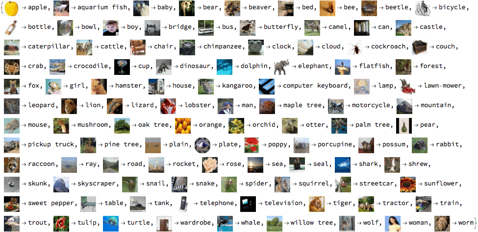

**Dataset**: [CIFAR100](https://www.tensorflow.org/datasets/catalog/cifar100), 100 classes and 600 images per class. 50,000 images for
 training and, 10,000 images reserved for testing.

clone repo:

`git clone https://github.com/RezaSoleymanifar/alex_net_gpu.git`

Model architecture:

start training:

`python alex_net_gpu.py`

Best model is saved each time an improvement in validation loss is triggered. tensorboard results are saved at each epoch.
For tensorboard run:

`tensorboard --logdir=tboard`

Result: achieves 94% training accuracy using RTX 2060 Nvidia GPU.

